# Mobile User Behavior
This repo contains an analysis on predicting a user's mobile usage.

## Exploratory Data Analysis

I've been doing exploratory data analysis manually in Python for years, and I wanted to attempt to use an LLM agent to help with this step, to see how well it would do. I followed the code and instructions from this Medium article (https://medium.com/@cubode/comprehensive-guide-using-ai-agents-to-analyze-and-process-csv-data-a0259e2af761), which uses the Langchain package, and the OpenAI API to help analyze data from a .csv file. In these first steps, I set up the agent and the prompts.

The notebooks/exploratory_data_analysis.ipynb prompts a ChatGPT agent to come up with charts or plots that it would use to visualize this data. The output lists several different types of plots that could be used to visualize and show relationships in this data. In general, the agent gets it right, with some manual help.

Through a combination of bar charts, box plots, and scatter plots, as well as a correlation matrix, we can visualize the relationships between certain variables. We can also look at which of the variables are correlated or seem to be related to user activity categorization, which is our target variable, or the variable we are interested in trying to predict.

Using a Langchain agent and ChatGPT, I was able to utilize an LLM to help guide us through the exploration of the data in the csv file on mobile users. Overall, it did a decent job of coming up with plots that would help us visualize the relationships of the data, but it fell short at completely coding the analysis for us. 

Although this isn't a fully comprehensive EDA, we can conclude a few things before moving on to building some models using this data. 

Firstly, the distribution of Android vs. OS users is skewed. We have about 1/3 of the OS users that we do Android users in the sample. I am curious to see how this plays out in predicting user behavior classes. 

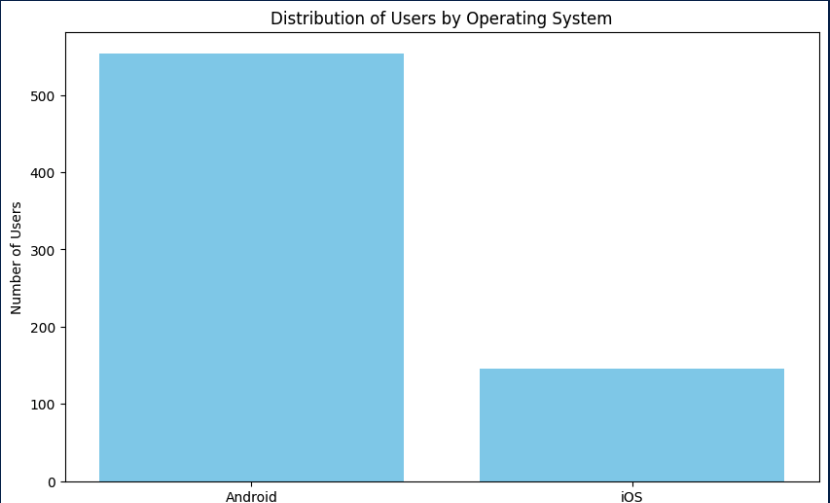

When it comes to the device model, however, we have a more evenly distributed number of users across 5 different device models. 

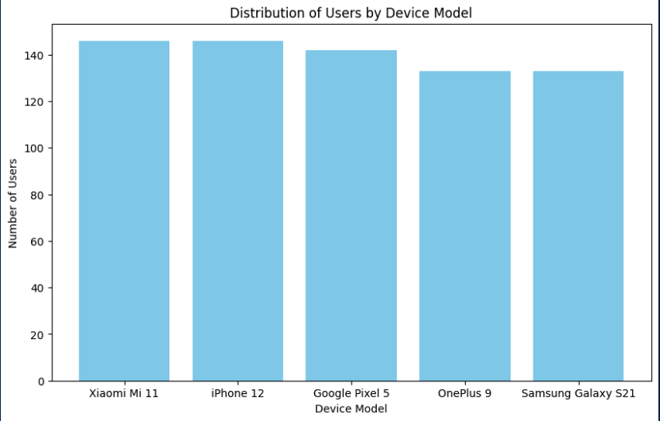

From eye-balling the cross-tabs of Operating System and Device Model with User Behavior Class, the most noticable findings are that for Android users, the number of users in each class decreases as the user behavior increases. For OS users, it's the opposite. There are the least number of users in the lowest user behavior class, and higher numbers of users in the highest behavior classes. 

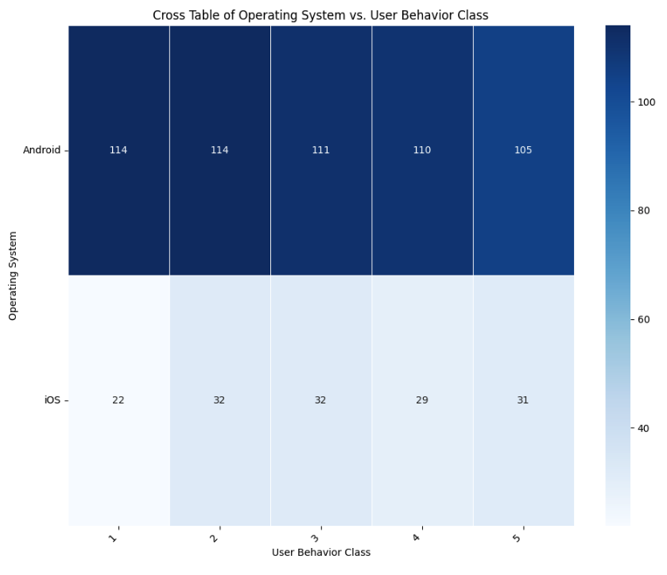

This trend is somewhat similar for the device models, but we see more variability in user behavior classes amongst Android devices. 

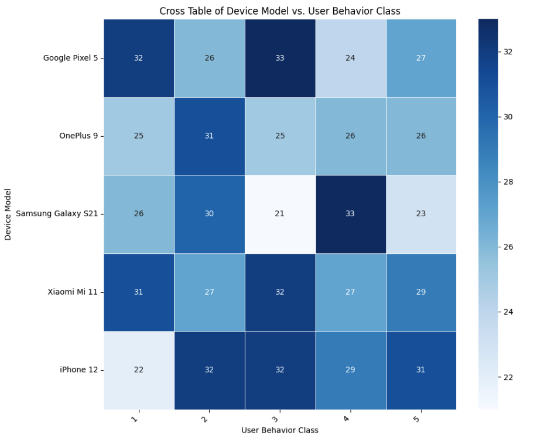

There is a pretty even distribution of genders and ages in the data sample, with slightly more males than females, and the lowest number of users under the age of 20.

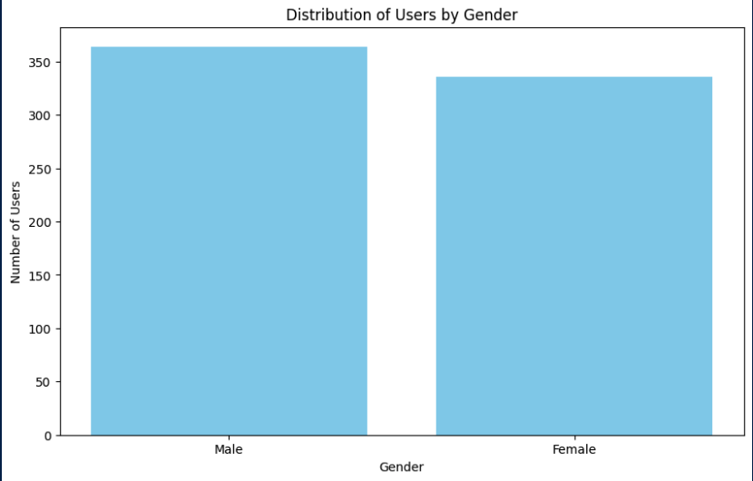

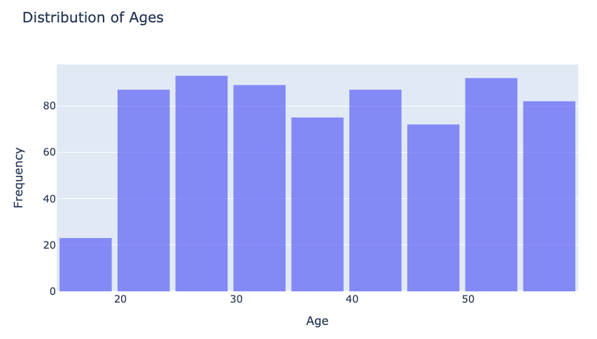

A cross tab of gender with user behavior class shows that there is a trend where there are the most number of women in user behavior class 3, and the least number of men overall in user behavior class 3, which is makes gender a useful variable for potentially predicting user behavior class.

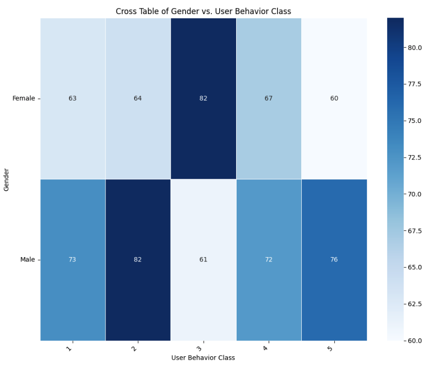

A box plot of age distributions across user behavior classes show that there is not much variability in median age across the different user behavior classes, but the median age in class 4 is slightly higher than the other classes, and the range of ages in classes 3 and 4 is wider.

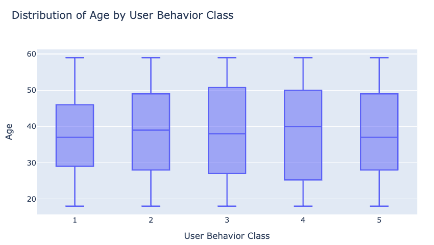

App usage is very clearly correlated with battery drain based on the scatter plot.

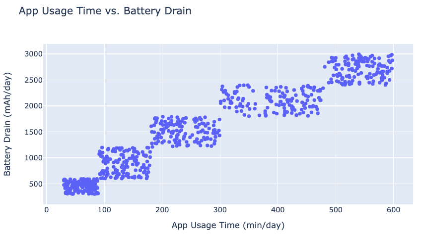

Screen time is also very clearly correlated with user behavior class, with higher screen times directly resulting in higher user behavior. 

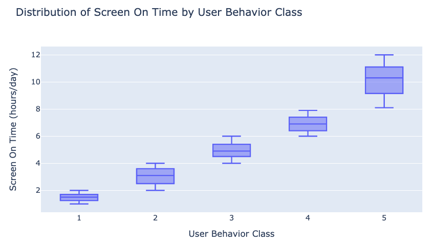

What's interesting about most of the numeric variables, like App Usage, Number of Apps, Battery Drainage, Screen time, and data usage is that they are mostly all highly correlated with each other and with the target variable, user behavior class. This is to be expected, but because they are all so highly correlated with one another, models that take a simplistic approach to using these variables (for example, only using one variable to predict user behavior), or that find interactions between these variables, may perform better.

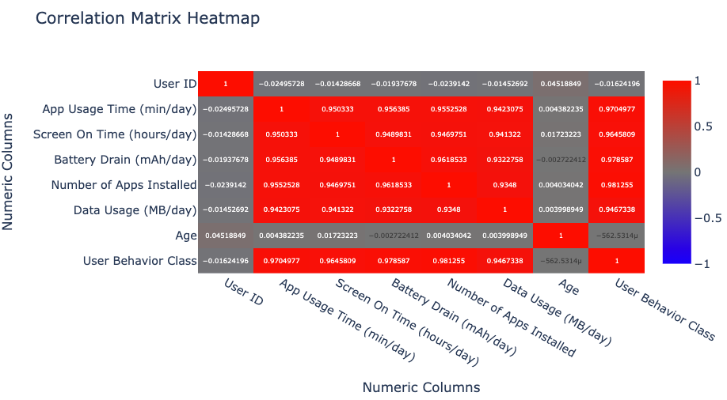

Overall, we have completed some initial exploration of this data set, and we are ready to build a model that predicts user behavior class.
