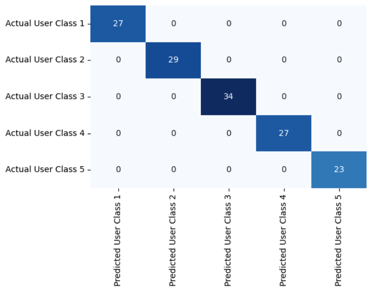
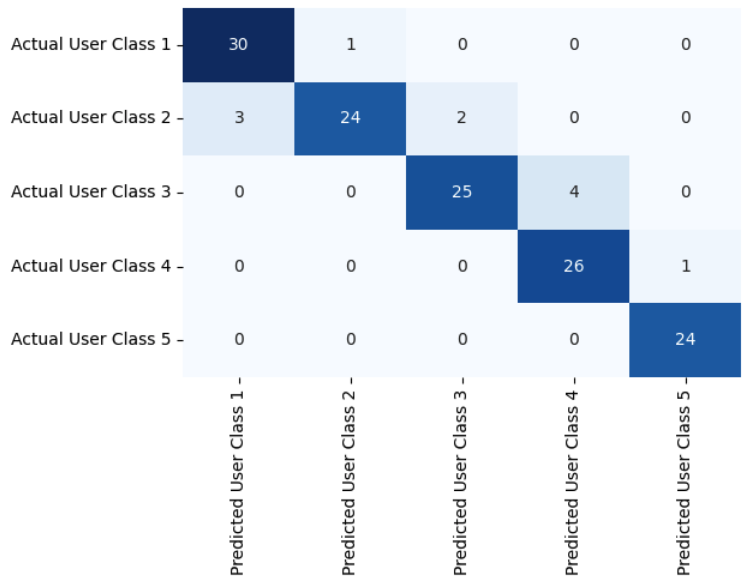
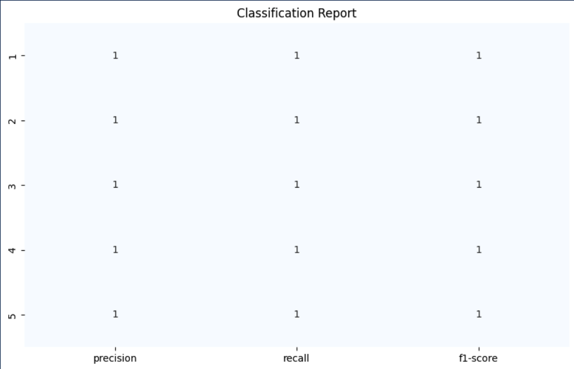

# Mobile User Behavior
This repo contains an analysis on mobile user behavior data. The data set was posted to kaggle here: https://www.kaggle.com/datasets/valakhorasani/mobile-device-usage-and-user-behavior-dataset/data. The goal of this project was to demonstrate the full cycle of exploring data, building a simple classifier, and evaluating that classifier.

## Exploratory Data Analysis

I've been doing exploratory data analysis manually in Python for years, and I wanted to attempt to use an LLM agent to help with this step, to see how well it would do. I followed the code and instructions from this Medium article (https://medium.com/@cubode/comprehensive-guide-using-ai-agents-to-analyze-and-process-csv-data-a0259e2af761), which uses the Langchain package, and the OpenAI API to help analyze data from a .csv file. In these first steps, I set up the agent and the prompts.

The notebooks/exploratory_data_analysis.ipynb prompts a ChatGPT agent to come up with charts or plots that it would use to visualize this data. The output lists several different types of plots that could be used to visualize and show relationships in this data. In general, the agent gets it right, with some manual help.

Through a combination of bar charts, box plots, and scatter plots, as well as a correlation matrix, we can visualize the relationships between certain variables. We can also look at which of the variables are correlated or seem to be related to user activity categorization, which is our target variable, or the variable we are interested in trying to predict.

Using a Langchain agent and ChatGPT, I was able to utilize an LLM to help guide us through the exploration of the data in the csv file on mobile users. Overall, it did a decent job of coming up with plots that would help us visualize the relationships of the data, but it fell short at completely coding the analysis for us. 

Although this isn't a fully comprehensive EDA, we can conclude a few things before moving on to building some models using this data. 

Firstly, the distribution of Android vs. OS users is skewed. We have about 1/3 of the OS users that we do Android users in the sample. I am curious to see how this plays out in predicting user behavior classes. 

When it comes to the device model, however, we have a more evenly distributed number of users across 5 different device models. 

From eye-balling the cross-tabs of Operating System and Device Model with User Behavior Class, the most noticable findings are that for Android users, the number of users in each class decreases as the user behavior increases. For OS users, it's the opposite. There are the least number of users in the lowest user behavior class, and higher numbers of users in the highest behavior classes. 

This trend is somewhat similar for the device models, but we see more variability in user behavior classes amongst Android devices. 

There is a pretty even distribution of genders and ages in the data sample, with slightly more males than females, and the lowest number of users under the age of 20.

A cross tab of gender with user behavior class shows that there is a trend where there are the most number of women in user behavior class 3, and the least number of men overall in user behavior class 3, which is makes gender a useful variable for potentially predicting user behavior class.

A box plot of age distributions across user behavior classes show that there is not much variability in median age across the different user behavior classes, but the median age in class 4 is slightly higher than the other classes, and the range of ages in classes 3 and 4 is wider.

App usage is very clearly correlated with battery drain based on the scatter plot.

Screen time is also very clearly correlated with user behavior class, with higher screen times directly resulting in higher user behavior. 

Most of the numeric variables, like App Usage, Number of Apps, Battery Drainage, Screen time, and data usage are all highly correlated with each other and with the target variable, user behavior class. This is to be expected, but because they are all so highly correlated with one another, models that take a simplistic approach to using these variables (for example, only using one variable to predict user behavior), or that find interactions between these variables, may perform better.

One thing that is important to note about these high correlations is that they potentially indicate something called "data leakage". This would be a very mild case of data leakage, but basically, the idea is that if you know a user's "Screen On Time", why do you need to know their User Behavior Class, since the two are so highly correlated? We will hypothesize on this some more in the modeling section.

Overall, we have completed some initial exploration of this data set, and we are ready to build a model that predicts user behavior class.

## Fitting a model to Mobile User Behavior

There are only 700 rows in the entire dataset, which means we have a small sample size to build a model from, but we can still split into a small train and test set and test out logistic regression and perhaps a tree-based model.

There is no missing data in the data set, which is rare and very easy to work with, as we won't have to worry about imputing missing values.

We created dummy variables from the categorical variables, or numeric representations of each category in a column, to be used in modeling, as non-numeric data cannot be used directly as an input into logistic regression models. 

Without yet knowing anything about model performance, I started out with a few hypotheses about the data we are using for modeling based on the exploratory data analysis. I ran an initial exploratory logistic regression in order to test those theories.

The first hypothesis is that the Device Model variable and the age variable are not going to have a big impact on predicting the User Behavior class, but the Operating System and Gender will have some impact. 

The second hypothesis is that since so many of the numeric variables are highly correlated with each other, also known as multicollinearity, the logistic regression model has difficulty determining which variable is driving the relationship with the outcome. As a result, the estimated coefficients (weights) can become highly sensitive to small changes in the data. This instability makes it hard to interpret the contribution of individual variables and can lead to unreliable coefficient estimates. This may be the biggest issue. There are several things we can do do remediate it, such as removing some of the correlated features and only leaving one, PCA, or regularization.

Another thing to note here: I one-hot encoded the categorical variables, so that each value in the variable became it's own column. Techinically, when you use one-hot encoding with logistic regression (or any other linear models), it's often recommended to remove one of the encoded variables to avoid the problem of multicollinearity, which occurs when the independent variables are highly correlated with each other. This is known as the dummy variable trap. The model cannot uniquely estimate the relationship of each variable with the outcome because one variable is perfectly predictable from the others.

For the first version of the logistic regression model, I am left all of the dummy variables in the model, but I remove one of the one-hot encoded columns for each variable in the next version.

Overall, as shown by the confusion matrix of actual vs predicted classes below, we were able to perfectly fit a logistic regression model to the User Behavior Classes. To me, this indicates a few possibilities:

1. Variables like Screen On Time are so highly correlated with the User Behavior Class that this input variable basically gives away the answer as to a user's behavior class. In the EDA notebook, we saw that a boxplot of screen time almost perfectly breaks the users into user behavior classes by Screen On Time. This variable, plus some of the other numeric variables lead directly to the answer.

2. Our model is likely overfit due to a large number of inputs and a small sample size. This means that the model is performing really well on this small test data set, but it may not perform as well on a larger data set in the real world. 

The model seems to predict user behavior class well, but for the sake of using less resources in deployment and avoiding overfitting, we can reduce the number of model inputs and still have a decent model.

Next, I used only 3 inputs- gender, operating system, and screen time, since all of these features had a relationship with User Behavior class, and we want to avoid multicollinearity, therefore leaving out the other highly correlated numeric variables.

Although this version of the model performs decently, this model does not perform as well as the previous model that had issues with multicollinearity and over-fitting. Gender and Operating System may not have be as strong of predictors as some of the other numeric variables that we included in the first model. I am going to try a different method to see if I can get better performance.

The model above, built with fewer input features and removing inputs that would cause multicollinearity, was decent, but we can definitely achieve higher metrics with this problem since the input data is so correlated with the target variable. In the next model, I tried out using PCA. PCA, or Principal Components Analysis, reduces the dimensionality and has the effect of guarding against multicollinearity. In short, PCA compacts the variance for a number a variables into a reduced number of components or values that represent the most valuable information in the original variables.

By using PCA on the 5 numeric variables (App Usage Time, Screen On Time, Battery Drain, Number of Apps Installed, Data Usage (MB/day)), I was able to reduce the feature space to one component or one dimension. This make sense, because all of these variables are so highly correlated with one another. The one component we create from the 5 variables accounts for ~95% of the variance in the variables.

Next, I built a new logistic regression model that uses just this PCA component as an input. My hypothesis this time around was that the numeric variables are so highly correlated with one another and with the target (user behavior class), that we could probably get higher metrics by just using the variance from these 5 numeric variables.

After building another logistic regression model that uses the component we created using PCA as the input, you can see that the model has 100% accuracy, as our first model with all of the features had. The difference between this model and the first model is that we reduced the dimensionality of the input features, to account for multicollinearity and to hopefully reduce over-fitting. 

The latest model we have built has perfect metrics when predicting on a test data set that we separated from the sample. Aside from accuracy, some of the metrics that we look at are Precision, Recall, and the F1 score. 

Precision measures how many of the users that were predicted to be in a given user behavior class are actually in that class. In a multi-class problem, every single class has it's own precision value. We can see in the chart that our model has 100% precision.

Recall meausre how many of the users that are actually in each user behavior class were identified correctly be the model. Although it is similar to precision, it's different in that the denominator is the pool of users who were actually in each class. For precision, the denominator is the pool of users who were predicted in each class. The chart shows that our model has 100% recall.

The F1 score combines precision and recall into a single score by taking their harmonic mean. F1 score is the most useful in problems that have imbalanced data, because it strikes a balance between precision and recall. In our case, the F1 score is 100%.

I did attempt a few other ways of reducing the dimensionality and accounting for multicollinearity in the model. I tried building an interaction variable between all of the numeric variables and then using that as the input to the model. Interaction variables account for multicollinearity because they create a mathematical representation of the relationships between the correlated variables (for example, using an input that is a product of two or more correlated input features). 

The model I created using an interaction feature as an input did not perform well, an was especially bad at predicting classes 1 and 3. I didn't end up pursuing this method further, as I was eager to try PCA as a way of accomplishing a similar feat.

## Conclusion

The purpose of exploring this data set and building a small logistic regression model was to demonstrate some of the key steps when exploring a data sample, as well as the key steps in building a logistic regression model. 

As fancy as machine learning and AI have become,linear and logistic regression models are still widely used in the industry because they are meaningful and impactful in terms of performance. Regression models are easily explainable, which is why they can come in handy in situations where there is a great need to explain why a model is making a certain prediction.

In this project, we looked at the relationships between several different variables on mobile users and their relationship to mobile user behavior class. We also built a logistic regression model that was able to perfectly predict user behavior class on a test data set that the model had not been trained on. Some of the steps that we took in building the logistic regression model to reduce over-fitting and to make sure the model ran were:

1. Turning categorical variables into dummy variables, or numeric representations of the variable that would work as inputs to the model.
2. Checking the model for missingness.
3. Checking to see how correlated the inputs to the model are so that we can avoid multicollinearity.
4. Reducing the input variables in general, which helps avoid overfitting.
5. Using PCA to reduce the dimensionality of the input features, which also helps avoid overfitting.

Having a model that perfectly predicts an outcome can be a sign of over-fitting, in this case likely due to a small sample size. The data sample was also a very clean, easy-to-work-with sample that had no missing values, and some very strong predictors of user behavior class. In the industry, it can be rare to find such clean data samples with obvious predictors. However, running through these steps with this data sample demonstrates how you can approach multi-class prediction problems with other data samples. 

